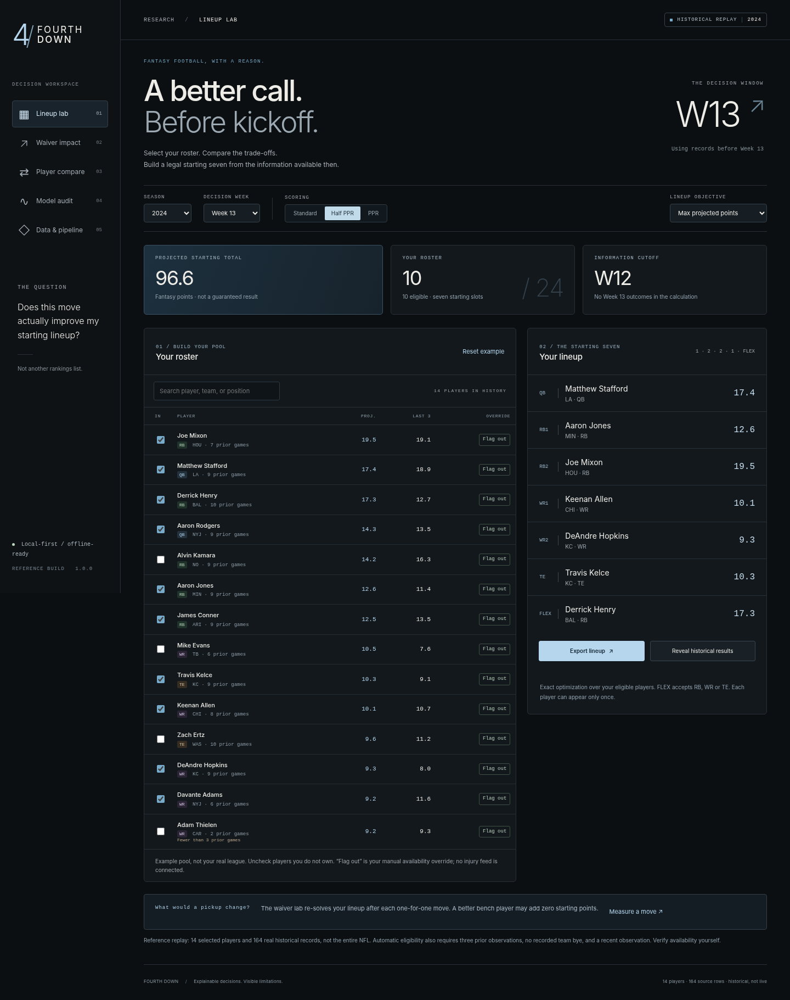
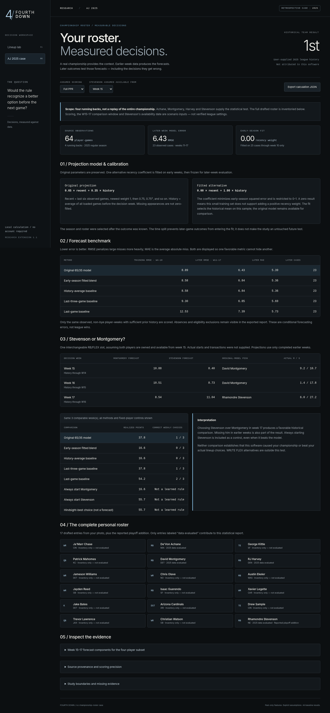

# Fourth Down
### Fantasy Lineup Lab

> **Cloud setup update — October 6, 2026:** Four reference artifacts have now been uploaded through the AWS console to a private, versioned, SSE-S3-encrypted bucket in us-east-2. The boto3 adapter and CloudFormation template were not used for this deployment. The user subsequently ran the Free Edition notebook in Databricks and confirmed its final PASS: 164 source records and 14 forecasts verified. This confirmation is user-reported; exported runtime evidence has not yet been collected. `cloud/databricks/free_edition_run.py` is a self-contained notebook prepared for Free Edition; it uses an exact embedded copy of the S3 dataset rather than a direct S3 connection. See `reports/cloud_setup_status.json`. Older build reports below describe the original pre-deployment build.


**Does a pickup actually improve your starting lineup—or just look good in a ranking?**

Fourth Down turns a small set of historical NFL records into an explicit roster decision. Select your players, choose a scoring format, build a legal starting seven, and measure the marginal effect of a one-for-one pickup. Every projection has an explanation. Historical results remain separate until you deliberately reveal them.



## AJ 2025 championship-roster case — new in 1.1

```bash
python3 -m fourth_down --case-2025
```

The new **AJ 2025 case** navigation link opens a retrospective research workspace. It inventories all 17 drafted players and the reported Stevenson playoff addition. Its statistical diagnostic currently evaluates **four running backs and 64 published 2025 player-game records**, not the full team or actual championship bracket.

It preserves the original 65/35 heuristic, fits one alternative coefficient using weeks 4–10, and evaluates weeks 11–17 on identical observed player-weeks. The Stevenson/Montgomery comparison displays every included week and all controls, including controls that outperform the model. Scoring and assumed acquisition week are interactive inputs. There is no fabricated historical usage or causal championship claim.

Read [the executed case study](docs/CHAMPIONSHIP_2025.md). Reproduce all calculations with:

```bash
python3 -m fourth_down.championship
python3 -m unittest discover -s tests -v
```

This build passed **103 unit/API tests**, including 34 added checks. The new workspace passed **21 browser checks** using an HTTP relay because the build environment blocks direct browser navigation. The relay uses the actual API, not hard-coded model responses. AWS S3 uploads were subsequently completed through the console, and the user confirmed a successful Databricks Free Edition run; see the cloud status section below.



---

## Run it

Requires **Python 3.10 or newer**. The local application uses the Python standard library only. No pip install, Node.js, cloud account, API key, or paid data subscription is required for the bundled replay.

**Windows:** unzip the project, open the `fourth-down` folder, and double-click **`Launch Fourth Down.bat`**. Keep the terminal open while using the app.

**macOS / Linux:** open a terminal inside the extracted folder and run:

```bash
python3 -m fourth_down
```

The app opens a browser at `http://127.0.0.1:8765`. On Windows, the equivalent terminal command is `py -3 -m fourth_down`. Stop it with Ctrl+C. An occupied port can be changed with `--port 8766`.

Do not double-click `app/index.html`: it needs the Python API. This is a local development application, **not a publicly hosted service**. Do not expose its development server to the internet.

## The actual product

| Workspace | Decision it supports |
|---|---|
| **Lineup lab** | Which legal QB / RB / RB / WR / WR / TE / FLEX combination maximizes the selected objective? |
| **Waiver impact** | How does the best starting total change after adding one available-in-the-example-pool player and dropping one roster player? |
| **Player compare** | What historical records and explicit formula produced these two projections? |
| **Model audit** | How large were the historical errors relative to two simple baselines on identical observations? |
| **AJ 2025 case** | What does an explicitly retrospective test of four players from the personal championship-roster story actually support? |
| **Data & pipeline** | Where did each input come from, what validation runs, and which cloud components have not been executed? |

The example roster is fictional. “Try this move” changes local browser state only. It does not modify a fantasy-platform roster or claim that a player is available in your league.

### Included replay

The offline dataset contains **164 actual historical player-game records for 14 selected players, 2024 regular-season Weeks 3–16**. Default decision: Week 13. It is deliberately a small reproducible reference fixture, **not full-NFL coverage, a current-season feed, or a live start/sit service**.

Source values were transcribed from a commit-pinned public mirror of nflverse player statistics. The manifest records the mirror, commit, transformation and file checksum. No simulated player outcomes are mixed into this reference. The external automated reconciliation script requires internet and was not run in the network-isolated build environment; schema, checksum, scoring, and model tests were run locally.

Full historical-data import is included below. NFL team labels reflect the last observed record; they are not current rosters. No injury, depth-chart, league-ownership, betting-odds, or weather feed is connected.

## A decision, not a magic score

Scoring is based on the source’s standard fantasy-point total plus **0 / 0.5 / 1 point per reception**. The app does not support every custom league bonus.

For each player, using **only records before the chosen week**:

```text
recent = up to six most recent observed games
weights = 0.75^age, where the newest observation has age 0
projection = 0.65 × weighted_recent_mean + 0.35 × loaded_history_mean
```

The constants are explicit design choices, not learned coefficients. This is an explainable forecasting heuristic, not a trained machine-learning model. In the curated fixture, “loaded history” starts in Week 3; it must not be called a complete season-to-date average.

Default objective: sum of projected points. Optional “steadier” objective: sum of each projection minus **0.25 × that player’s recent historical standard deviation**. This is a preference penalty, not a probability of winning or a covariance-aware lineup-risk model. Historical quartiles are descriptive—not prediction intervals.

### Legal lineup optimization

Exact bitmask dynamic programming considers seven slots and unique player IDs. FLEX accepts RB, WR, or TE. A copied state frontier for each player prevents duplicate use. Complexity is **O(N × S × 2^S)** with S = 7. Unit tests compare its result with an independent exhaustive solver over randomized small rosters.

Automatic eligibility requires at least three loaded prior games, no known team bye, and an observation within the preceding two weeks. Manual “Flag out” overrides always exclude a player. These are conservative rules, **not confirmation of health or playing status**. The bundled bye map covers 2024 only. The UI caps rosters at 24 players. Waiver analysis evaluates each eligible nonrostered candidate and legal one-for-one drop; large imported universes take longer than the reference fixture.

## Honest evaluation

The walk-forward audit advances one week at a time, calculates features from prior weeks, and scores eligible predictions only where a target-week outcome exists. Missing rows are **unknown**, not zero. All three methods use the same evaluation rows.

Bundled reference, half PPR:

| Method | Observed predictions | Mean absolute error | Root mean squared error |
|---|---:|---:|---:|
| Recency blend | 121 | 6.1191 | 7.6802 |
| Loaded-history mean | 121 | 6.2254 | 7.8946 |
| Previous observed game | 121 | 7.8579 | 9.8531 |

**Three eligible predictions had no recorded target-week outcome and were excluded from the error metrics.** This selected, single-season sample does not demonstrate a statistically established advantage, a live forecasting edge, or superior fantasy results. Do not convert it into an “improved prediction accuracy” résumé claim.

Reproduce the results:

```bash
python -m fourth_down --check
python -m scripts.export_artifacts
```

The export includes normalized source data, projections, a row-level audit, and SHA-256 checksums in `data/processed/`. See `docs/MODEL_CARD.md` for limitations.

## What the code demonstrates

**Python:** typed modules, strict data contracts, deterministic calculations, exact optimization, counterfactuals, JSON HTTP endpoints, structured errors and testable dependency injection.

**SQL:** parameterized queries, primary-key constraints, rolling-window calculations, partitioned means, row numbering, and time-cutoff controls.

**JavaScript / HTML / CSS:** a custom responsive interface, asynchronous API calls, form state, interactive player comparisons, SVG charts, accessible controls, export actions and safe text rendering. No CDN or frontend build system.

**Cloud extensions:** an explicit boto3 S3 upload adapter, a private-storage CloudFormation template, and a Databricks PySpark/Delta notebook sharing the normalized data contract. These are separate optional paths; the local app does not claim to be executing them.

## Import fuller historical data

On a connected computer, from this project folder:

```bash
python -m scripts.import_nflverse --season 2024 --output data/full_2024.csv
python -m fourth_down --data data/full_2024.csv
```

The downloader targets the nflverse all-seasons weekly player-statistics release, then selects 2024 regular-season QB/RB/WR/TE records. It checks the source schema, retains the point totals and receptions, and rejects inconsistent or malformed records. It never silently replaces an unavailable download with fake data. The download command has **not been integration-tested against the remote host from this environment**.

An already-downloaded upstream CSV can be normalized without a network request:

```bash
python -m scripts.import_nflverse --input path/to/stats_player_week.csv --season 2024 --output data/full_2024.csv
```

Your own normalized CSV or JSON array can be passed directly with `--data`. Required fields:

```text
player_id,name,position,team,season,week,opponent,standard_points,receptions
```

Use a separate filename, not the protected reference CSV. Other seasons require an appropriate bye schedule or manual exclusions; the automatic importer deliberately limits this build to 2024.

To compare every bundled row against the preserved source mirror on a connected computer:

```bash
python -m scripts.verify_reference
```

## AWS and Databricks: explicit execution status

| Component | Status in this deliverable |
|---|---|
| Local Python / SQLite application | Executed and tested |
| S3 upload planning and client argument contract | Tested with a fake client; no AWS calls |
| S3 dry-run command | Executed locally |
| CloudFormation storage template | Included; not deployed or validated by AWS |
| Databricks Free Edition notebook | User confirmed PASS: 164 records and 14 forecasts verified; runtime export not yet collected |
| Original S3-connected Databricks notebook | Syntax checked; this direct integration has not been executed |
| AWS S3 storage | Four artifacts uploaded through the console; private, versioned, SSE-S3 encrypted |
| Direct S3-to-Databricks connection | Not configured; Free Edition uses an embedded copy of the same dataset |

The small reference fixture does not need distributed compute. The cloud path is an optional architecture exercise and integration point, not a necessary or proven scalability claim. Cloud resources can incur charges. No credentials belong in this repository.

Detailed instructions: [`cloud/aws/README.md`](cloud/aws/README.md) and [`cloud/databricks/README.md`](cloud/databricks/README.md).

## Tests and validation

```bash
python -m unittest discover -s tests -v
```

The current project passed **103 unit/API tests**, including leakage mutations, optimizer-versus-brute-force checks, invalid-input cases, same-cohort backtesting, scoring, manual exclusions, S3 argument contracts, and HTTP origin/host protections.

It also passed **29 Chromium UI smoke checks** at 1440 × 1080 and 390 × 844. This managed build environment blocked direct browser navigation, so the test harness loaded the actual HTML/CSS/JS and bridged its fetch calls to the actual local HTTP API. It did not hard-code model outputs. Direct browser-to-loopback navigation and localStorage persistence were not exercised in that harness. See the exact scope in `reports/browser-tests.json`.

Optional browser-test dependencies are in `requirements-dev.txt`. The local app itself requires neither Playwright nor pytest. Browser checks can be rerun while the server is running:

```bash
python -m scripts.browser_smoke --chromium /path/to/chromium
```

The core tests also have a GitHub Actions workflow. Its YAML is included; no hosted GitHub Actions run has been performed here.

## Repository map

```text
fourth_down/        Validated data, SQL bridge, model, optimizer, local HTTP server
app/               Responsive HTML/CSS/JavaScript interface
sql/               Database schema and pre-week historical window functions
data/              Reference CSV, provenance, example roster, 2024 bye map
scripts/           Import, batch export, source reconciliation, browser testing
cloud/aws/         S3 upload adapter and private-storage template
cloud/databricks/  PySpark / Delta batch notebook
tests/             Unit and HTTP tests
reports/           Actual local test outputs
docs/              Model card, interview walkthrough, résumé wording, screenshots
```

## Portfolio and attribution

This project was assembled with AI assistance. Treat it as a codebase to run, review, extend, and explain—not as proof that you have already independently mastered every technology. Do not label it UConn coursework or imply institutional sponsorship. Do not claim deployed AWS/Databricks experience until you have actually executed those paths.

See [`docs/RESUME.md`](docs/RESUME.md) for technically accurate wording and [`docs/INTERVIEW_GUIDE.md`](docs/INTERVIEW_GUIDE.md) for a code-level walkthrough.

Application code: MIT license. Historical data: nflverse attribution under CC BY 4.0; see `THIRD_PARTY_NOTICES.md`. No NFL, team, university, cloud-provider, or fantasy-platform endorsement is implied.
